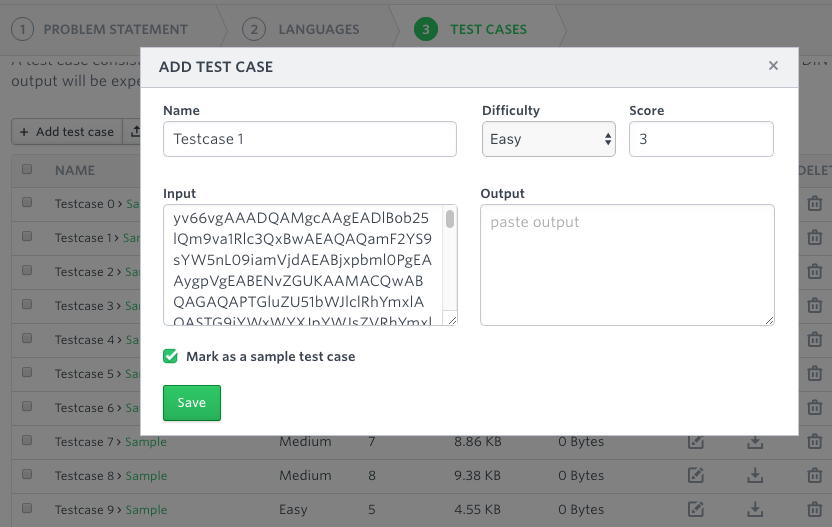

# hackerrank-java-tools
This project provides useful utility classes for creating automatically graded Java challenges in HackerRank.
You might find it useful if your company uses HackerRank for screening Java candidates and you need to go beyond
tests that work on a simplistic input/output principle.

**NOTE:** `hackerrank-java-tools` is *not* a solution repository for HackerRank challenges; it will only be
useful if you have a *HackerRank for Work* account and frequently design your own Java challenges for the purpose
of applicant screening.

## Problem Statement
One of HackerRank's key features is its capability to automatically grade a submission based on test cases. Especially
if you are dealing with a high volume of applications, automatic grading is absolutely essential.
Unfortunately, the way HackerRank defines test cases is pretty simplistic: test input is sent to `System.in` and
output is read from `System.out`, which is then compared against an expected output string.

This approach has several disadvantages:
  * it is cumbersome to create test cases that have large inputs, as commonly used for testing edge cases
  * it is difficult to create test cases that have more than one correct answer
  * it is impossible to create test cases that assert properties of the code itself (e.g., code metrics or method attributes)
  * it is not possible to use standard JUnit tests for automatic grading

## Solution Description
`hackerrank-java-tools` offers a solution for these problems by providing a simple framework that allows test cases to
be specified either as Java source code or as Base64-encoded bytecode. The latter option is a good solution for challenges
where you don't want to reveal exactly how you test the validity of a candidate's solution.

## Usage Instructions
  1. paste the `SourceTest` or `BinaryTest` source files into the Head/Tail section of your HackerRank test
  2. remove the `public` modifier from the main `Solution` class (there can only be one public class)
  3. typically, you might also want to disable *Show head and tail code stubs to candidates* (under *Advanced Settings*)
  4. paste the binary or source code (depending on the test type you chose) into the *Input* field of the test case:

That's it! You can leave the *Output* field empty, because by default a successful test will not produce any output.

## Known Limitations
Though a significant step forward from HackerRank's simple input/output test cases, `hackerrank-java-tools` has a few
known limitations:
  * both source and binary tests must compile into a single class file (this also means no nested classes are supported)
  * as the main `Solution` class is no longer public, tests must access the class via reflection
  * binary tests are currently not encrypted and can be relatively easily reverse-engineered
  * standard JUnit libaries are not on HackerRank's classpath, and therefore it is not possible to write actual JUnit tests
